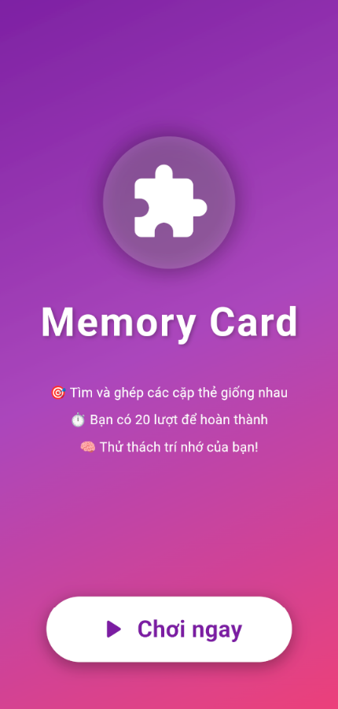
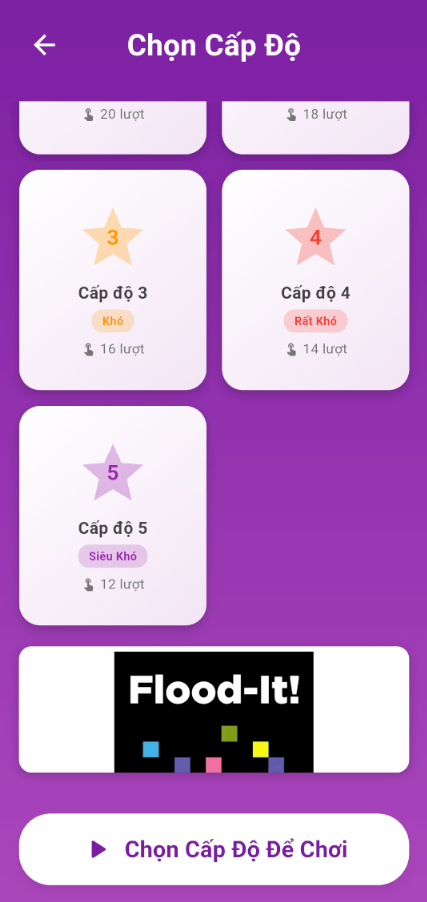
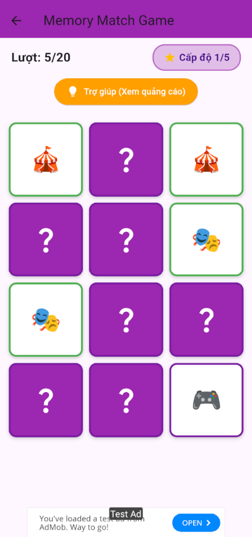
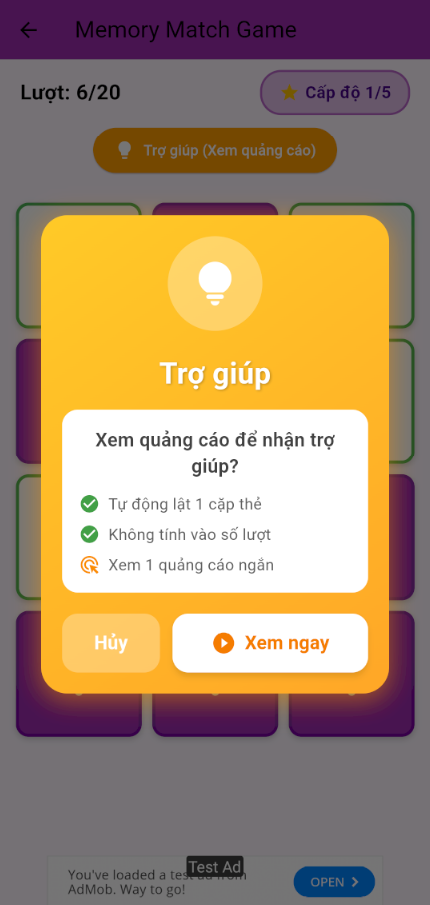
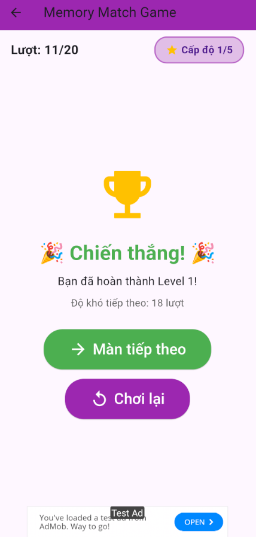

# 🎮 Memory Card Game with AdMob Integration

A mobile puzzle game built with **Flutter** demonstrating **Google AdMob monetization strategies** including Banner, Interstitial, Rewarded, Native and App Open ads.

This project focuses on **SDK integration, ad lifecycle management, and mobile game UI development**.
 

## 🎬 Demo


 <br/>
## 🖼 Screenshots 
Intro Page                |  Select Level       |        Gameplay         
:-------------------------:|:-------------------------:|:-------------------------: 
||.


Help                    |   Ad Demo             |  Finished    
:-------------------------:|:-------------------------:|:-------------------------:
||.
 
<br/>

### ✨ Key Features

- 🎯 **5 Difficulty Levels**: From easy (20 turns) to super hard (12 turns)
- 🎨 **Modern UI/UX**: Gradient backgrounds, animations, and responsive design
- 💰 **5 Types of AdMob Ads**: Banner, Interstitial, Rewarded, App Open, Native
- 🆘 **Help System**: Check the rewarded ad to flip a pair of cards.
- 📊 **Level Selection**: Level selection screen with native ads
- 🔄 **Smart Ad Management**: Cooldown logic to avoid spam ads
 


## 🔧 Tech Stack

- **Framework**: Flutter 3.x
- **Language**: Dart
- **Ads SDK**: `google_mobile_ads: ^5.0.0`
- **State Management**: setState (simple, sufficient)
- **Platform**: Android & iOS
 
 

### Code Metrics

- **Total Lines**: ~1,500 lines
- **Files**: 15 Dart files
- **Ad Managers**: 5 classes
- **Pages**: 3 screens
- **Widgets**: Modular & reusable
- **Constants**: Centralized configuration

---

## 📦 AdMob Integration Details

### ✅ Implemented Ad Formats (5/6)

| Ad Type | Location | Usage Strategy | eCPM Potential |
|---------|----------|----------------|----------------|
| **Banner Ad** | Top & Bottom của HomePage | • Always visible during gameplay<br>• Non-intrusive passive income | Low |
| **Interstitial Ad** | Between levels & replay | • When moving to the next level<br>• When selecting "Play again" | High |
| **Rewarded Ad** | Help feature | • Opt-in: Active user viewing<br>• Reward: Automatically flips a pair of cards<br>• Not counted towards the number of turns| Very High |
| **App Open Ad** | App resume (foreground) | • When the app returns from the background: • Has a 4-hour cooldown • Does not show after rewarded/interstitial |  Medium |
| **Native Ad** | Level Selection Page | • Blends into the natural UI.<br>• Size: 120px height<br>• Non-disruptive | Medium |

### 📊 Ad Placement Strategy

```
IntroPage (Welcome screen)
    ↓
LevelSelectionPage 
    • Native Ad (120px, middle of the screen)
    ↓ (Chọn level 1-5)
HomePage (Game chính)
    • Banner Ad (Top)
    • Banner Ad (Bottom)
    • Help Button → Rewarded Ad
    ↓ (Win/Lose)
Game Over Screen
    • "Next screen" → Interstitial Ad
    • "Replay" → Interstitial Ad
    
Background → Foreground
    • App Open Ad (if no ads have just appeared)
```

### 🚫 Not Implemented

- **Rewarded Interstitial Ad**: It's not necessary because we already have Interstitial + Rewarded.

---

## 📂 Project Structure

```
📂lib/
├── main.dart                            
├──📂models/
│   └── card_item.dart                  
├──📂pages/
│   ├── intro_page.dart                 
│   ├── level_selection_page.dart      
│   └── home_page.dart                  
├──📂services/
│   ├── app_open_ad_manager.dart       
│   ├── banner_ad_manager.dart          
│   ├── interstital_ad_manager.dart     
│   ├── reward_ad_manager.dart          
│   └── native_ad_manager.dart         
├──📂utils/
│   └── constants.dart                 
└──📂widgets/
    └── banner_ad_widget.dart                        
```
## 📚 Documentation

- **[PROJECT_STRUCTURE.md](PROJECT_STRUCTURE.md)**: Detailed architecture
- **[CLEANUP_SUMMARY.md](CLEANUP_SUMMARY.md)**: Refactoring history
- **[TROUBLESHOOTING.md](TROUBLESHOOTING.md)**: Common issues
 
## 🚀 Getting Started

### Prerequisites

```bash
flutter --version  # Flutter >=3.0.0
```

### Installation

1. **Clone the repository**
```bash
git clone <your-repo-url>
cd demo_admobs
```

2. **Install dependencies**
```bash
flutter pub get
```

3. **Configure AdMob**

**For Testing (Current Setup):**
- Using Google's test Ad Unit IDs
- No configuration needed

**For Production:**
- Update Ad Unit IDs in `lib/utils/constants.dart`
- Replace test IDs with your real AdMob IDs:
  ```dart
  static String get bannerAdUnitId => Platform.isAndroid
      ? 'ca-app-pub-XXXXXXXXXXXXXXXX/XXXXXXXXXX'  // Your Android ID
      : 'ca-app-pub-XXXXXXXXXXXXXXXX/XXXXXXXXXX'; // Your iOS ID
  ```

4. **Run the app**
```bash
flutter run
```

### 🔧 Configuration Files

#### Android Setup (`android/app/build.gradle`)
```gradle
dependencies {
    implementation 'com.google.android.gms:play-services-ads:XX.X.X'
}
```

#### iOS Setup (`ios/Podfile`)
```ruby
platform :ios, '12.0'
# AdMob pods auto-added via pubspec.yaml
```

---

## 🎮 How To Play

1. **Launch App** → See Intro Page
2. **Tap "Chơi ngay"** → Level Selection Page
3. **Choose Level** (1-5) → Tap selected level card
4. **Tap "Chơi Cấp Độ X"** → Start game
5. **Flip Cards** → Find matching pairs
6. **Use Help** (Optional) → Watch rewarded ad → Auto-flip 1 pair
7. **Win** → Next level or replay
8. **Lose** → Try again

### 🏆 Level Difficulty

| Level | Max Moves | Difficulty | Color |
|-------|-----------|------------|-------|
| 1 | 22 | Easy | 🟢 Green |
| 2 | 20 | Medium | 🔵 Blue |
| 3 | 18 | Hard | 🟠 Orange |
| 4 | 16 | Very Hard | 🔴 Red |
| 5 | 12 | Extreme | 🟣 Purple |

---

## 💰 Monetization Strategy

### Revenue Optimization

1. **Passive Income**: Banner ads always visible
2. **High eCPM Points**: Interstitial at natural breaks
3. **User Value**: Rewarded ads offer real benefit (help)
4. **Re-engagement**: App Open ads for returning users
5. **Native Blend**: Less intrusive, better CTR

### Best Practices Implemented

✅ **No ad spam**: Cooldown logic, strategic placement  
✅ **User choice**: Rewarded ads are opt-in  
✅ **Natural breaks**: Interstitials between levels  
✅ **Proper disposal**: All ads disposed correctly  
✅ **Error handling**: Fallbacks when ads fail to load  
✅ **Test IDs**: Safe for development  

 
 
 

## 📄 License

This project is for educational purposes. AdMob integration follows Google's policies.

---

## 👤 Author

PHẠM NGỌC MINH

---
 

**Made with ❤️ using Flutter**
